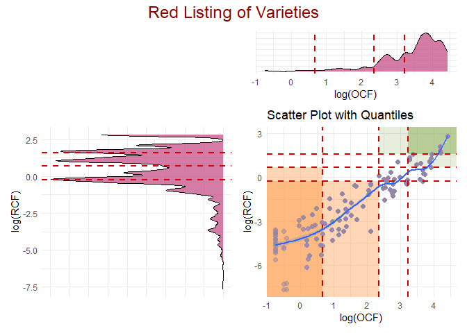
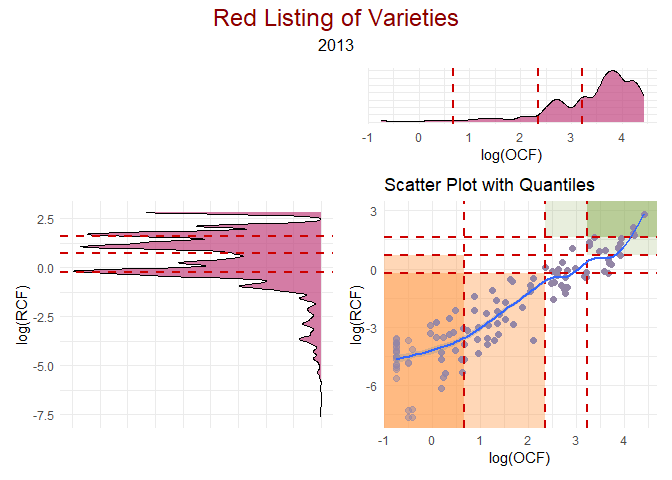
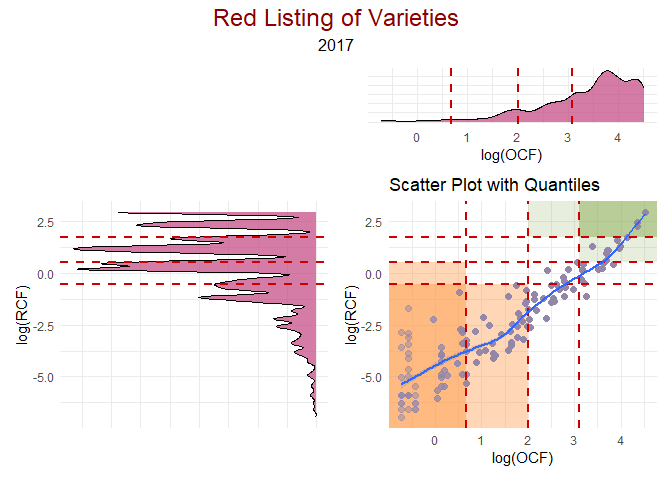

<!-- README.md is generated from README.Rmd. Please edit that file -->

# EndangeRed

<!-- badges: start -->
<!-- badges: end -->

The goal of EndangeRed is to provide a tool to calculate the Red Listing
of varieties based on the Overall Cultivar Frequency (OCF) and Relative
Cultivar Frequency (RCF) values.

## Installation

You can install the development version of EndangeRed like this:

``` r
remotes::install_github("https://github.com/CENTRO-INTERNACIONAL-DE-LA-PAPA/EndangeRed")
```

## Example

This is a basic example which shows you how to get the Red Listing of
varieties based on the Overall Cultivar Frequency (OCF) and Relative
Cultivar Frequency (RCF) values.

Here we have two years of data, 2013 and 2017 on the same location.

``` r

library(EndangeRed)
library(dplyr)
#> 
#> Adjuntando el paquete: 'dplyr'
#> The following objects are masked from 'package:stats':
#> 
#>     filter, lag
#> The following objects are masked from 'package:base':
#> 
#>     intersect, setdiff, setequal, union
library(tidyr)
data(varieties_data)

table(varieties_data$Año)
#> 
#> 2013 2017 
#> 3531 3185
```

First let’s select a year. For this example we will use 2013.

``` r

varieties_data_2013 <- varieties_data %>%
    filter(Año == 2013)

ocf_data <- OCF(
    dfr = varieties_data_2013,
    vname = "variety_name",
    hh = "household_code",
    community = "community",
    location = "location"
)

print(head(ocf_data))
#> # A tibble: 6 × 7
#>   community      nhh variety_name  nhhxvarie   ccf sumccf    OCF
#>   <chr>        <int> <chr>             <int> <dbl>  <dbl>  <dbl>
#> 1 Castillapata    70 Achanqayra            5  7.14   7.14  2.38 
#> 2 Castillapata    70 Allqa Suytu           4  5.71   9.35  3.12 
#> 3 Castillapata    70 Allqa frescos         3  4.29   4.29  1.43 
#> 4 Castillapata    70 Allqa palta           9 12.9   96.9  32.3  
#> 5 Castillapata    70 Allqa suytu           1  1.43   1.43  0.476
#> 6 Castillapata    70 Allqay Walash        11 15.7   73.7  24.6

rcf_data <- RCF(
    dfr = varieties_data_2013,
    vname = "variety_name",
    hh = "household_code",
    nsvarie = "number_of_tubers",
    community =
        "community",
    location = "location"
)

print(head(rcf_data))
#> # A tibble: 6 × 9
#>     Año variety_name   hh     community nsvarie location totalhcfxvarie total_hh
#>   <dbl> <chr>          <chr>  <chr>       <dbl> <chr>             <dbl>    <int>
#> 1  2013 Chiqchi Pasña  Hua_C… Castilla…      13 Huancav…          6.56       176
#> 2  2013 Puca aqu suytu Hua_C… Castilla…      20 Huancav…         29.6        176
#> 3  2013 Peruanita      Hua_C… Castilla…      30 Huancav…         10.7        176
#> 4  2013 Santo domingo  Hua_C… Castilla…      30 Huancav…          0.682      176
#> 5  2013 Allqay Walash  Hua_C… Castilla…      37 Huancav…          1.13       176
#> 6  2013 Camotillo      Hua_C… Castilla…      70 Huancav…          8.48       176
#> # ℹ 1 more variable: RCF <dbl>
```

Now, we can plot the OCF and RCF values in normal scale by using the
function `Plot_Variable_Red_Listing`.

``` r

Plot_Variable_Red_Listing(ocf_data, rcf_data,type = "normal")
```


Or in log scale:

``` r

Plot_Variable_Red_Listing(ocf_data, rcf_data,type = "log")
```



If we need to get the varieties inside each quadrant we can do it by
using the function `Get_Red_Listing`.

``` r

combined_scales <- Get_Red_Listing(ocf_data, rcf_data,type = "log")

print(combined_scales)
#> # A tibble: 8 × 3
#>   OCF_scale           RCF_scale   varieties 
#>   <fct>               <fct>       <list>    
#> 1 very few households very scarse <chr [47]>
#> 2 few households      very scarse <chr [31]>
#> 3 many households     very scarse <chr [13]>
#> 4 many households     scarse      <chr [8]> 
#> 5 many households     common      <chr [1]> 
#> 6 most households     scarse      <chr [5]> 
#> 7 most households     common      <chr [9]> 
#> 8 most households     abundant    <chr [5]>

red_listing_varieties <- combined_scales$varieties[[1]]

print(red_listing_varieties)
#>  [1] "Culebras"              "Chiqchi Wali"          "Casa Blanca"          
#>  [4] "Puka Wara"             "Ayrampu"               "Kuchipa Qallun"       
#>  [7] "Yuraq Oca"             "Muru Kututu"           "Allqa suytu"          
#> [10] "Suytu Oca"             "Puka Camotillo"        "Yuraq Ipillu"         
#> [13] "Clavelina"             "Duraznillo"            "Yana wayru"           
#> [16] "Ruywash"               "Chikñas Morado"        "Yana llumchuy waqachi"
#> [19] "Allqa frescos"         "Muru Gaspar"           "Llamapa Sullun"       
#> [22] "Azul Wayta"            "Ojos De Caiman"        "Ikichina"             
#> [25] "Yana Poncho"           "Guindo Camotillo"      "Tumbay"               
#> [28] "Alqu Yupi"             "Callwa Shiri"          "Puka Masa Waqachi"    
#> [31] "Riti Waqachi"          "Amarilis"              "Maswa Papa"           
#> [34] "Qillu Suytu"           "Puka Markina"          "Puka Cucharcas"       
#> [37] "Yuraq tuqu"            "Puka Puqya"            "Amillica"             
#> [40] "Suytu Dusis"           "Churquillay"           "Misipa Makin"         
#> [43] "Azul Reboso"           "Supa Puchquchi"        "Uqi palta"            
#> [46] "Renacimiento"          "Sumchillay"
```

Now, what if we want to get the Red Listing of both years? We can do it
by using the following code:

``` r

library(patchwork)
library(purrr)

nested_data <- varieties_data %>% 
    group_by(Año) %>% 
    nest()

nested_data <- nested_data %>% 
    mutate(
        OCF = map(data, ~OCF(
            dfr = .x,
            vname = "variety_name",
            hh = "household_code",
            community = "community",
            location = "location"
        )),
        RCF = map(data, ~RCF(
            dfr = .x,
            vname = "variety_name",
            hh = "household_code",
            nsvarie = "number_of_tubers",
            community = "community",
            location = "location"
        )),
        Plots = pmap(list(OCF, RCF,Año), ~Plot_Variable_Red_Listing(.x, .y,type = "log") + 
                         patchwork::plot_annotation(
                             subtitle = Año,
                             theme = ggplot2::theme(plot.subtitle = ggplot2::element_text(size = 12, hjust = 0.5, colour = "black"))
                         )),
        combined_scales = map2(OCF, RCF, ~Get_Red_Listing(.x, .y,type = "log"))
    )

nested_data
#> # A tibble: 2 × 6
#> # Groups:   Año [2]
#>     Año data                 OCF      RCF      Plots      combined_scales 
#>   <dbl> <list>               <list>   <list>   <list>     <list>          
#> 1  2013 <tibble [3,531 × 5]> <tibble> <tibble> <patchwrk> <tibble [8 × 3]>
#> 2  2017 <tibble [3,185 × 5]> <tibble> <tibble> <patchwrk> <tibble [9 × 3]>
```

Notice that we have created a list of plots and a list of combined
scales for each year. We can access the data by using the following
code:

For the year 2013:

``` r
nested_data$Plots[[1]]
#> `geom_smooth()` using method = 'gam' and formula = 'y ~ s(x, bs = "cs")'
```



``` r
nested_data$combined_scales[[1]]$varieties[[1]]
#>  [1] "Culebras"              "Chiqchi Wali"          "Casa Blanca"          
#>  [4] "Puka Wara"             "Ayrampu"               "Kuchipa Qallun"       
#>  [7] "Yuraq Oca"             "Muru Kututu"           "Allqa suytu"          
#> [10] "Suytu Oca"             "Puka Camotillo"        "Yuraq Ipillu"         
#> [13] "Clavelina"             "Duraznillo"            "Yana wayru"           
#> [16] "Ruywash"               "Chikñas Morado"        "Yana llumchuy waqachi"
#> [19] "Allqa frescos"         "Muru Gaspar"           "Llamapa Sullun"       
#> [22] "Azul Wayta"            "Ojos De Caiman"        "Ikichina"             
#> [25] "Yana Poncho"           "Guindo Camotillo"      "Tumbay"               
#> [28] "Alqu Yupi"             "Callwa Shiri"          "Puka Masa Waqachi"    
#> [31] "Riti Waqachi"          "Amarilis"              "Maswa Papa"           
#> [34] "Qillu Suytu"           "Puka Markina"          "Puka Cucharcas"       
#> [37] "Yuraq tuqu"            "Puka Puqya"            "Amillica"             
#> [40] "Suytu Dusis"           "Churquillay"           "Misipa Makin"         
#> [43] "Azul Reboso"           "Supa Puchquchi"        "Uqi palta"            
#> [46] "Renacimiento"          "Sumchillay"
```

For the year 2017:

``` r
nested_data$Plots[[2]]
#> `geom_smooth()` using method = 'gam' and formula = 'y ~ s(x, bs = "cs")'
```



``` r
nested_data$combined_scales[[2]]$varieties[[1]]
#>  [1] "Tomasa"               "Allqa Suytu"          "Achanqayra"          
#>  [4] "Allqopa yuntun"       "Tuqra"                "Mariva"              
#>  [7] "Huayllina"            "Muru Gaspar"          "Kichka matanka"      
#> [10] "Puka culebra"         "Puka Qala Suytu"      "Callwa Shiri"        
#> [13] "Yana Walash"          "Antalucia"            "Clon biofortificado" 
#> [16] "Qano"                 "Puka Puqya"           "Muru torro"          
#> [19] "Yana tullu"           "Andahuaylina"         "Awela papa"          
#> [22] "Quri waqachi"         "Puka Walash"          "Llamapa rurun"       
#> [25] "Tongina"              "Muru wali"            "Chaucha"             
#> [28] "Muru pasña"           "Yawar Sonqo"          "Leona"               
#> [31] "Puka allqa walash"    "Yuraq Winqu"          "Llamapa ñawin"       
#> [34] "Azul reboso"          "Papa saco largo"      "Condorpa uman"       
#> [37] "Chauchillas"          "Llashuena"            "Qillu Suytu"         
#> [40] "Nativa"               "Yana ipillu"          "Condorpa chaquin"    
#> [43] "Color moraleta"       "Huantinopa mediasnim" "Misipa Makin"        
#> [46] "Sumaq Sonqo"          "Tornillo"             "Vacapa Runtun"       
#> [49] "Puka Capiro"          "Yana manto"           "Condor allqa"        
#> [52] "Yuraq Tumbay"
```
