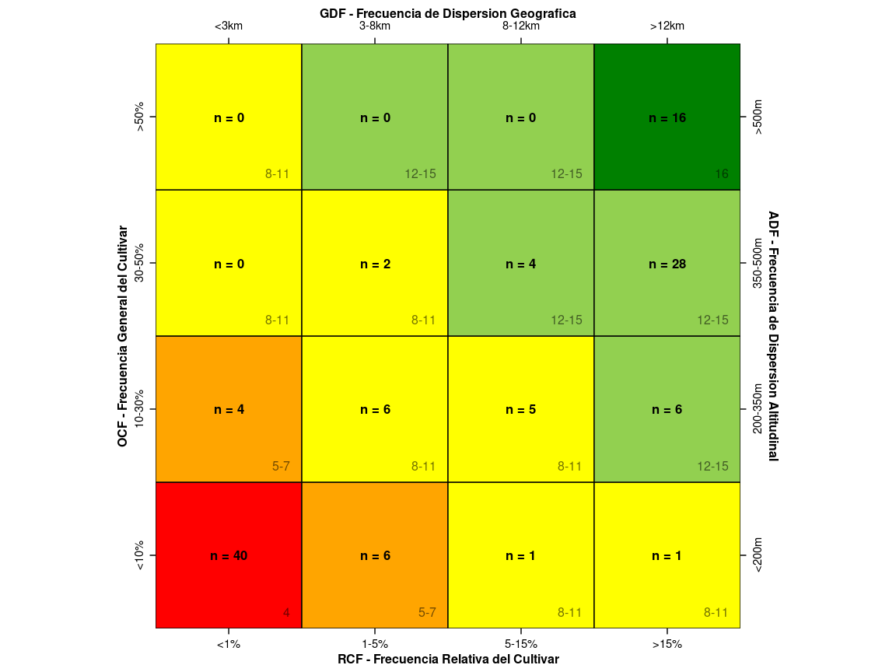

<!-- README.md is generated from README.Rmd. Please edit that file -->

# EndangeRed

<!-- badges: start -->

<!-- badges: end -->

The goal of EndangeRed is to provide a tool to calculate the Red Listing
of varieties based on the Overall Cultivar Frequency (OCF) and Relative
Cultivar Frequency (RCF) values.

## Installation

You can install the development version of EndangeRed like this:

``` r
remotes::install_github("https://github.com/CENTRO-INTERNACIONAL-DE-LA-PAPA/EndangeRed")
```

## Example

This is a basic example which shows you how to get the Red Listing of
varieties based on the Overall Cultivar Frequency (OCF) and Relative
Cultivar Frequency (RCF) values.

Here we have two years of data, 2013 and 2017 on the same location.

``` r

library(EndangeRed)
library(dplyr)
#> 
#> Attaching package: 'dplyr'
#> The following objects are masked from 'package:stats':
#> 
#>     filter, lag
#> The following objects are masked from 'package:base':
#> 
#>     intersect, setdiff, setequal, union
library(tidyr)

data("Huancavelica_2013")

Huancavelica_2013 %>%
    head(6)
#> # A tibble: 6 × 44
#>      id unique_id_hjuarez source         year   id1 id_ppgis join  region codigo
#>   <dbl>             <dbl> <chr>         <dbl> <dbl> <lgl>    <chr> <chr>  <lgl> 
#> 1 14257             26959 https://doi.…  2013  3187 NA       CA-0… Huanc… NA    
#> 2 14258             26960 https://doi.…  2013  3188 NA       CA-0… Huanc… NA    
#> 3 14259             26961 https://doi.…  2013  3189 NA       CA-0… Huanc… NA    
#> 4 14260             26962 https://doi.…  2013  3190 NA       CA-0… Huanc… NA    
#> 5 14261             26963 https://doi.…  2013  3191 NA       CA-0… Huanc… NA    
#> 6 14262             26964 https://doi.…  2013  3192 NA       CA-0… Huanc… NA    
#> # ℹ 35 more variables: potato_landraces_data_set_cusco_code_id <chr>,
#> #   comunidad <chr>, familia <chr>, household <chr>, parcela <dbl>,
#> #   synonyms <chr>, cantidad <dbl>, categoria <chr>, sub_parcela <chr>,
#> #   area_m2 <dbl>, area_ha <dbl>, altitud <dbl>, r_alt_200 <chr>,
#> #   r_alt_100m <chr>, categoria_final <chr>, sum_ctdad <dbl>, a_var_m2 <dbl>,
#> #   a_var_ha <dbl>, cod_fam <chr>, sum_var_xfaml <dbl>, n_cmdes <dbl>,
#> #   n_famls <dbl>, fam_total_region <dbl>, final_variety_name <chr>, …
```

First let’s select a year. For this example we will use Huancavelica
data from 2013.

``` r

ocf_data <- OCF(
    dfr = Huancavelica_2013,
    vname = "final_variety_name",
    hh = "household",
    community = "comunidad",
    location = "region"
)

print(head(ocf_data))
#> # A tibble: 6 × 7
#>   community      nhh variety_name  nhhxvarie   ccf sumccf    OCF
#>   <chr>        <int> <chr>             <int> <dbl>  <dbl>  <dbl>
#> 1 Castillapata    70 Achanqayra            5  7.14   7.14  2.38 
#> 2 Castillapata    70 Allqa Suytu           4  5.71   9.35  3.12 
#> 3 Castillapata    70 Allqa frescos         3  4.29   4.29  1.43 
#> 4 Castillapata    70 Allqa palta           9 12.9   96.9  32.3  
#> 5 Castillapata    70 Allqa suytu           1  1.43   1.43  0.476
#> 6 Castillapata    70 Allqay Walash        11 15.7   73.7  24.6

rcf_data <- RCF(
    dfr = Huancavelica_2013,
    vname = "final_variety_name",
    hh = "household",
    nsvarie = "cantidad",
    community = "comunidad",
    location = "region"
)

print(head(rcf_data))
#> # A tibble: 6 × 47
#>      id unique_id_hjuarez source       year   id1 id_ppgis join  location codigo
#>   <dbl>             <dbl> <chr>       <dbl> <dbl> <lgl>    <chr> <chr>    <lgl> 
#> 1 14257             26959 https://do…  2013  3187 NA       CA-0… Huancav… NA    
#> 2 14258             26960 https://do…  2013  3188 NA       CA-0… Huancav… NA    
#> 3 14259             26961 https://do…  2013  3189 NA       CA-0… Huancav… NA    
#> 4 14260             26962 https://do…  2013  3190 NA       CA-0… Huancav… NA    
#> 5 14261             26963 https://do…  2013  3191 NA       CA-0… Huancav… NA    
#> 6 14262             26964 https://do…  2013  3192 NA       CA-0… Huancav… NA    
#> # ℹ 38 more variables: potato_landraces_data_set_cusco_code_id <chr>,
#> #   community <chr>, familia <chr>, hh <chr>, parcela <dbl>, synonyms <chr>,
#> #   nsvarie <dbl>, categoria <chr>, sub_parcela <chr>, area_m2 <dbl>,
#> #   area_ha <dbl>, altitud <dbl>, r_alt_200 <chr>, r_alt_100m <chr>,
#> #   categoria_final <chr>, sum_ctdad <dbl>, a_var_m2 <dbl>, a_var_ha <dbl>,
#> #   cod_fam <chr>, sum_var_xfaml <dbl>, n_cmdes <dbl>, n_famls <dbl>,
#> #   fam_total_region <dbl>, variety_name <chr>, plots_cusc <lgl>, …
```

If we need to get the endangered varieties we can do it by using calling
the function `get_red_listing`.

``` r

# Calculate risk categories
results <- get_red_listing(
  data = Huancavelica_2013,
  variety_name_col = "final_variety_name",
  community = "comunidad",
  household = "household",
  count = "cantidad",
  coord_names = c("long", "lat"),
  elevation_name = "altitud"
)

# Summary of variety status
table(results$risk_category)
#> 
#>                At Risk     Critically At Risk Potentially Vulnerable 
#>                    115                     83                   1296 
#>                 Secure    Stable, Low Concern 
#>                    287                   1848
```

Let’s see which varieties are the ones **At Risk**

``` r

results %>%
  dplyr::filter(risk_category %in% c("At Risk", "Critically At Risk")) %>%
  dplyr::select(final_variety_name, risk_category, OCF_scale, RCF_scale) %>%
  distinct() %>%
  head()
#> # A tibble: 6 × 4
#>   final_variety_name risk_category      OCF_scale           RCF_scale  
#>   <chr>              <fct>              <fct>               <fct>      
#> 1 Culebras           At Risk            very few households very scarce
#> 2 Chiqchi Wali       Critically At Risk very few households very scarce
#> 3 Casa Blanca        Critically At Risk very few households very scarce
#> 4 Puka Wara          Critically At Risk very few households very scarce
#> 5 Ayrampu            Critically At Risk very few households very scarce
#> 6 Achanqayra         Critically At Risk very few households very scarce
```

We can also visualize the 4 risk dimensions (`OCF`, `RCF`, `GDF`, `ADF`)
as a faceted matrix where each tile label is the number of varieties in
that exact class combination.

``` r

plot_red_4d(results)
```


