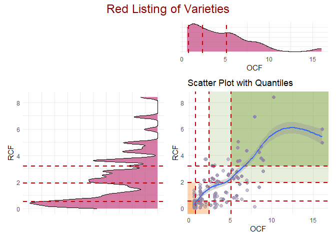
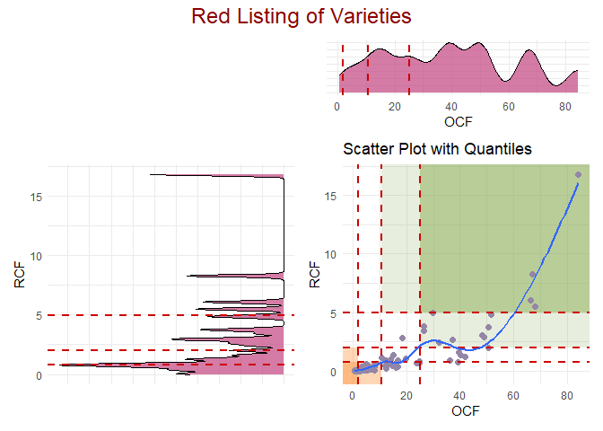

<!-- README.md is generated from README.Rmd. Please edit that file -->

# EndangeRed

<!-- badges: start -->
<!-- badges: end -->

The goal of EndangeRed is to …

## Installation

You can install the development version of EndangeRed like so:

``` r
remotes::install_github("https://github.com/CENTRO-INTERNACIONAL-DE-LA-PAPA/EndangeRed")
```

## Example

This is a basic example which shows you how to get the Red Listing of
varieties.

First, we need to calculate the Overall Cultivar Frequency (OCF) and
Relative Cultivar Frequency (RCF).

``` r
library(EndangeRed)

data(varieties_data)

ocf_data <- OCF(
    dfr = varieties_data,
    vname = "variety_name",
    hh = "household_code",
    community = "community",
    location = "location"
)

print(head(ocf_data))
#> # A tibble: 6 × 7
#>   community       nhh variety_name nhhxvarie   ccf sumccf   OCF
#>   <chr>         <int> <chr>            <int> <dbl>  <dbl> <dbl>
#> 1 Chaccllabamba    41 variety_10           1  2.44   5.56 1.39 
#> 2 Chaccllabamba    41 variety_106          1  2.44   2.44 0.610
#> 3 Chaccllabamba    41 variety_11           2  4.88  23.8  5.95 
#> 4 Chaccllabamba    41 variety_112          1  2.44   7.70 1.93 
#> 5 Chaccllabamba    41 variety_117          1  2.44   2.44 0.610
#> 6 Chaccllabamba    41 variety_118          1  2.44   2.44 0.610

rcf_data <- RCF(
    dfr = varieties_data,
    vname = "variety_name",
    hh = "household_code",
    nsvarie = "number_of_tubers",
    community =
        "community",
    location = "location"
)

print(head(rcf_data))
#> # A tibble: 6 × 8
#>   variety_name hh       community location nsvarie totalhcfxvarie total_hh   RCF
#>   <chr>        <chr>    <chr>     <chr>      <dbl>          <dbl>    <int> <dbl>
#> 1 variety_10   Farmer_… Cochacoc… Challab…     115          0.552       73 0.757
#> 2 variety_149  Farmer_… Chacclla… Challab…     126          1.62        73 2.22 
#> 3 variety_104  Farmer_… Umana     Paucart…      56          2.27        27 8.40 
#> 4 variety_69   Farmer_… Umana     Paucart…     138          1           27 3.70 
#> 5 variety_111  Farmer_… Cochacoc… Challab…     192          0.188       73 0.257
#> 6 variety_448  Farmer_… Umana     Paucart…     171          0.274       27 1.01
```

Now, we can plot the OCF and RCF values in normal scale:

``` r

Plot_Variable_Red_Listing(ocf_data, rcf_data,type = "normal")
```



Or in log scale:

``` r

Plot_Variable_Red_Listing(ocf_data, rcf_data,type = "log")
```



If we need to get the varieties inside each quadrant we can do it by
using the function `Get_Red_Listing`.

``` r

combined_scales <- Get_Red_Listing(ocf_data, rcf_data)

print(combined_scales)
#> # A tibble: 14 × 3
#>    OCF_scale           RCF_scale   varieties 
#>    <fct>               <fct>       <list>    
#>  1 very few households very scarse <chr [23]>
#>  2 very few households scarse      <chr [7]> 
#>  3 few households      very scarse <chr [33]>
#>  4 few households      scarse      <chr [24]>
#>  5 few households      common      <chr [1]> 
#>  6 few households      abundant    <chr [2]> 
#>  7 many households     very scarse <chr [9]> 
#>  8 many households     scarse      <chr [14]>
#>  9 many households     common      <chr [10]>
#> 10 many households     abundant    <chr [4]> 
#> 11 most households     very scarse <chr [1]> 
#> 12 most households     scarse      <chr [6]> 
#> 13 most households     common      <chr [9]> 
#> 14 most households     abundant    <chr [10]>

red_listing_varieties <- combined_scales$varieties[[1]]

print(red_listing_varieties)
#>  [1] "variety_223" "variety_252" "variety_208" "variety_205" "variety_118"
#>  [6] "variety_123" "variety_52"  "variety_117" "variety_250" "variety_211"
#> [11] "variety_34"  "variety_215" "variety_221" "variety_242" "variety_57" 
#> [16] "variety_41"  "variety_238" "variety_220" "variety_256" "variety_137"
#> [21] "variety_94"  "variety_29"  "variety_106"
```
